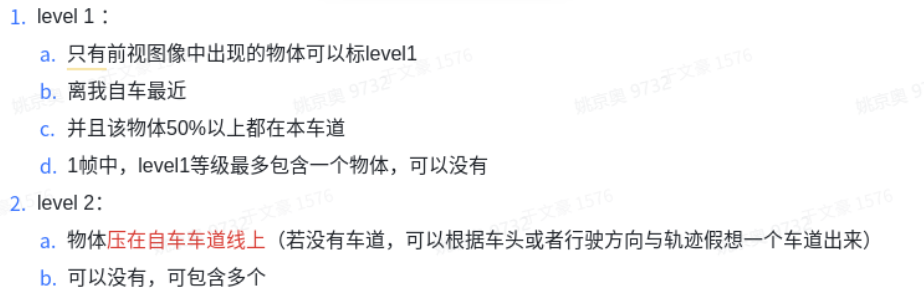

1.2 评测逻辑
--------------------

.. toctree::
   :maxdepth: 3

说明：只评测cipo中level1和level2目标，CIPO（closest in path of obstacles），包含四个level得目标

误差统计项计算流程：
a. 时间戳匹配
摄像头传感器时间戳与gt时间戳（激光时间戳）进行最近邻匹配。
b. Track匹配
    1. 计算CIPO所在的gt的track
    2. 计算dt所在track与gt所在track的IoU累积和
    3. 取最大IoU累积和所在的dt track作为匹配结果，如果rank 1的IoU累积和小于0.2，则认为无匹配结果
c. Track去噪
    4. 在track匹配对中，去掉有dt无gt和有gt无dt得数据
d. 指标计算
    5. 在track匹配对中，某一个时间戳，如果gt和dt的IoU > 0.1，则TP+1
    6. 如果TP+1，则这一组数据用于计算距离、速度和yaw误差。
准召和num项计算流程：
准确率（precision）计算：在上述误差统计项计算流程中得到TP后，TP除以匹配上的检测track中有效时间戳的个数。
召回率（recall）计算：在上述误差统计项计算流程中得到TP后，TP除以匹配上真值track中有效时间戳的个数。
num计算：在track匹配上后，num为track匹配对中既有检测结果又有真值结果，且dt与gt的iou>0.1的时间戳总个数（与计算yaw角等误差的目标总个数保持一致）。

