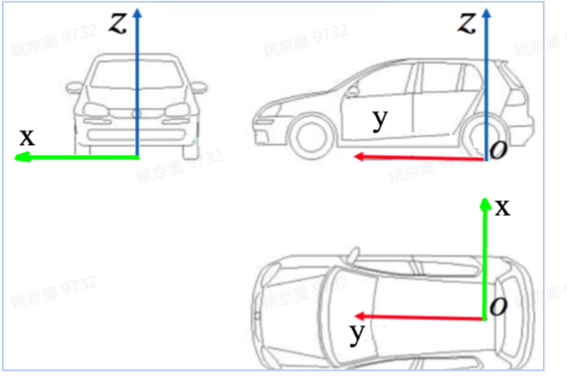
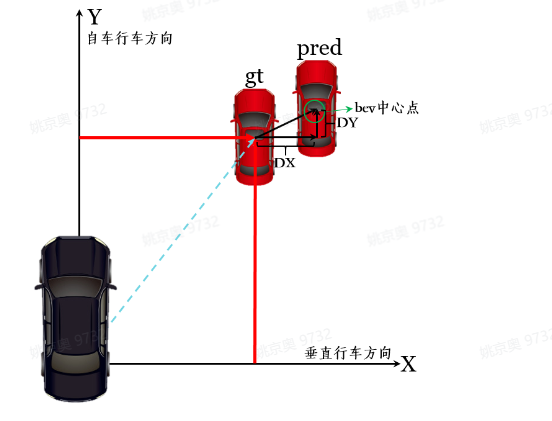
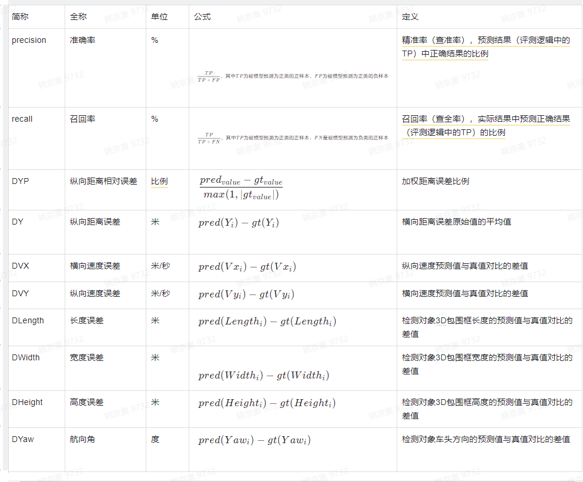

坐标系定义：采用VCS（Vehicle Coordinate System）坐标系，以自车后轴中心在地面上的投影点为原点的车辆坐标系，X代表横向（行车方向右侧垂直方向），Y代表（行车方向），示例图见下图1：

图1 VCS坐标系定义示例

距离的定义：通过轨迹关联，找到与任务检测到目标id对应的真值目标id，距离的计算是按照目标中心点据原点的距离来计算，距离的计算忽略pitch角的影响，通过tracking结果进行轨迹匹配，将每帧关联上的目标进行误差计算，\
距离的计算见图2：

其中pred__value指预测值，gt__value指真值。

图2 距离以及误差计算示意图

