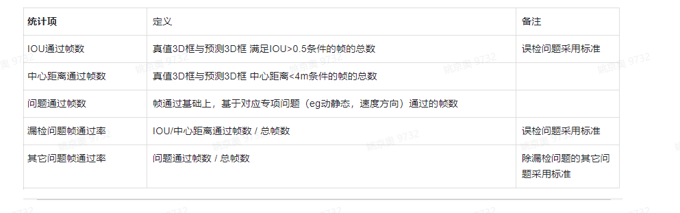

1.4 专项评测指标
------------------------------
.. toctree::
   :maxdepth: 3
   :hidden:

   list02
   list03
   list04

1.4.1 指标项：
~~~~~~~~~~~~~~~~~~~~~~~~~~~~~~~~~

1.4.2 统计项：
~~~~~~~~~~~~~~~~~~~~~~~~~~~~~~~~~

1.4.3 评测场景：
~~~~~~~~~~~~~~~~~~~~~~~~~~~~~~~~~
目前定义了7类：（有语义/无语义）漏检 / （有语义/无语义）误检 / 轨迹预测 / 速度反向 / 动静态