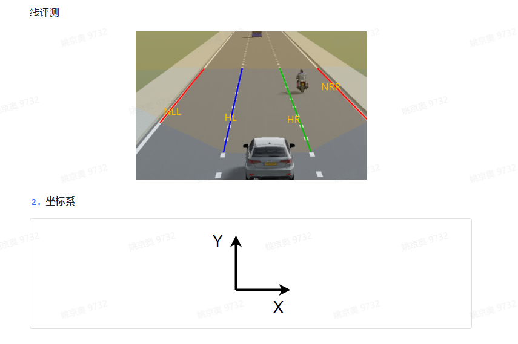
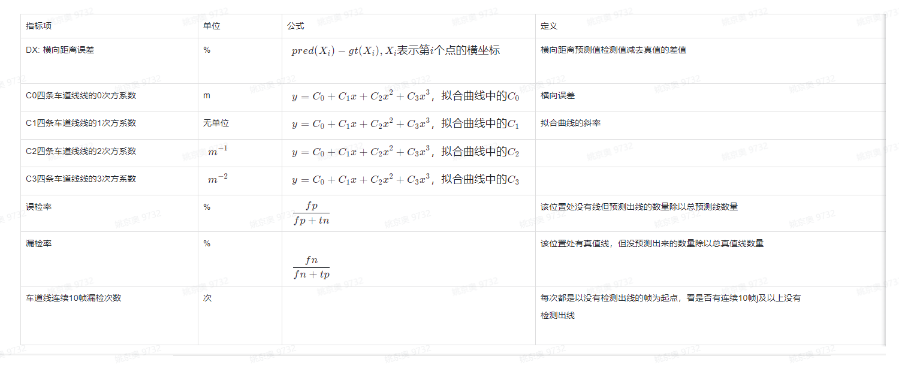
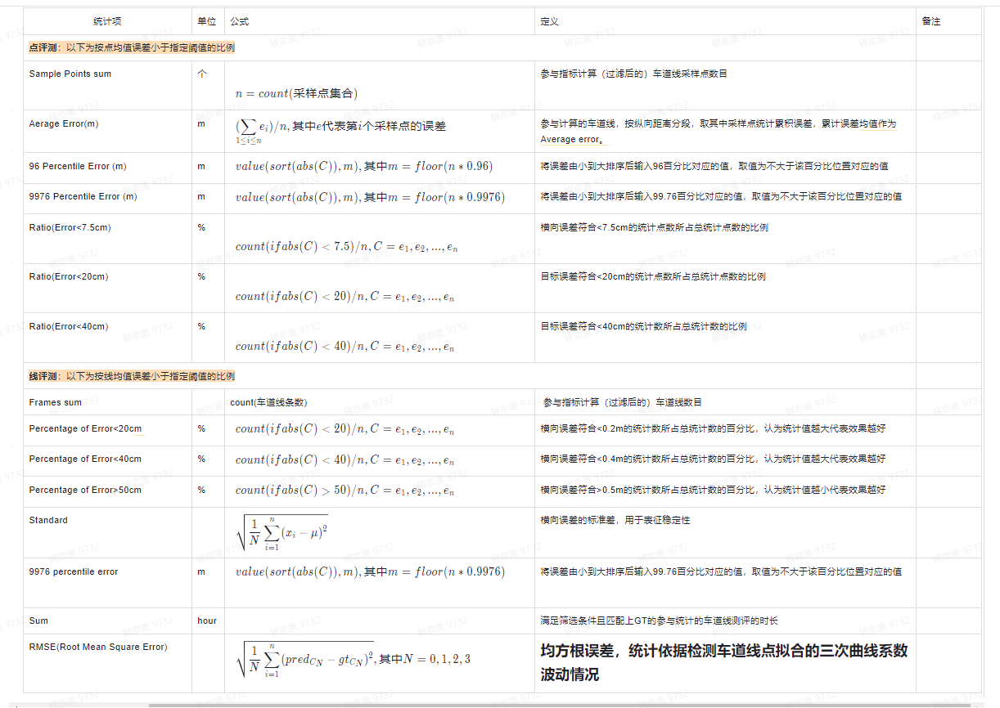

2.2 车道线评测
--------------------------------
.. toctree::
   :maxdepth: 3
   :hidden:

   list02
   list03
   list04

2.2.1 什么是车道线？
~~~~~~~~~~~~~~~~~~~~~~~~~~~~~~~~~
车道线是分隔不同行驶车道的实线或者虚线，通常包含不同的颜色，不同的线型，不同的类型（如道路边沿、合流/分流线等）

2.2.2 通用评测指标
~~~~~~~~~~~~~~~~~~~~~~~~~~~~~~~~~
针对拟合曲线进行点的评测和线得评测，点评测是依据语义分割模型检测结果拟合得曲线按照1m间距采样得到得点集，计算检测点和真值点距离误差，取预测线及真值线在纵轴方向0~20米、20～50米、50～100米、100～150米的点进行评测；线评测值语义分割模型检测得车道线拟合为一条三次曲线，进行线粒度得评测，主要统计整体性能，无距离分段。

1. 评测对象：
本版本评测评价目标是自车道左右两条线和自车道左左和右右两条车道线侧（参考下图示例），其中：
HL（host left）：车辆当前行驶车道的左侧车道线
HR（host right）：车辆当前行驶车道的右侧车道线
NLL（neighbour left left）：相对于HL再往左的一条线
NRR（neighbour right  right）：相对于HR再往右的一条线
评测只统计分类正确的线：例如：对于HL，取预测线Host中HL和真值线Host中HL，若都存在且同为DASH，则参与计算。

3. 取点方式介绍：
对于预测线，算法会给出线4个系数及车道线在纵轴方向的起始位置和终止位置。根据预测的4个系数构建车道线的三次曲线表示，以纵轴为0的位置开始（若预测线的起点纵轴位置大于0，则以起点位置开始），在纵轴方向每间隔1米采样一个点，直到终止位置。对于真值线，根据真值点拟合出三次曲线，然后以纵轴为0的位置开始，在纵轴方向每间隔1米采样一个点

4. 距离评测定义：
对于真值线，标注中没有给定车道线相对于车的位置信息。车在原点（0，0）处，取车道线在纵轴为0位置的横坐标信息，该横坐标表示距离车的远近。根据距离车的远近划分出HL、HR、NLL、NRR。若车道线起点位置的纵坐标大于0且小于20米，取该线的起点坐标。若车道线起点位置的纵坐标大于20米，舍弃该车道线

表3 车道线指标项汇总

统计项：
说明：C表示统计数据的集合，value(C,x)表示C中第x个数的值，sort(C)表示对C进行从小到大排序，floor(x)表示不大于x的整数，count(C)表示统计集合C中数据的总量，pred代表预测值，gt代表真值

表4 车道线指标统计项汇总

2.2.3 评测场景：
~~~~~~~~~~~~~~~~~~~~~~~~~~~~~~~~~
一维场景：目前定义了4类（白天*高速、白天*城区、夜晚*高速、夜晚*城区）
二维场景：按道路结构（弯道、直道、无车道线）
分距离评测：-10~120m（10米分段距离）